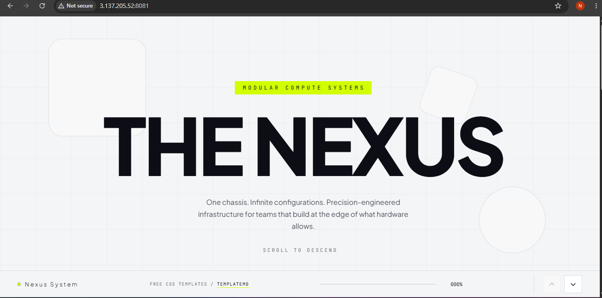
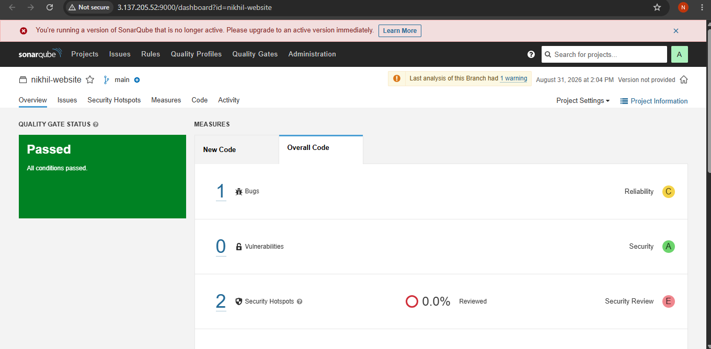
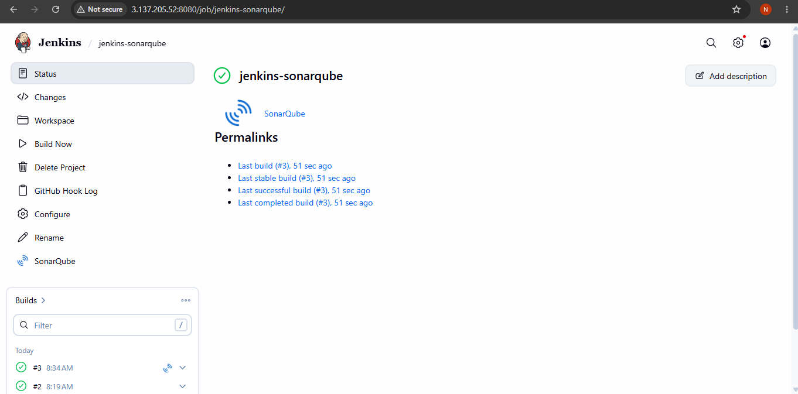

# Nexus Website — CI/CD Pipeline with Jenkins, SonarQube & Trivy

A static website (built on the **Nexus System** template) deployed through a fully automated CI/CD pipeline. Every push runs a code quality scan, a security vulnerability scan, and only deploys the site as a Docker container if both checks pass.



---

## 🚀 Pipeline Overview

```
GitHub Push
     │
     ▼
Jenkins Job Triggered
     │
     ▼
SonarQube Static Code Analysis
     │
     ├── Quality Gate FAILED ──► ❌ Pipeline stops
     │
     ▼ Quality Gate PASSED
Docker Image Build
     │
     ▼
Trivy Security Scan (HIGH & CRITICAL vulnerabilities)
     │
     ├── Vulnerabilities found ──► ❌ Pipeline stops
     │
     ▼ Scan PASSED
Old Container Removed → New Container Deployed
     │
     ▼
✅ Website Live
```

## 🧰 Tech Stack

| Tool | Purpose |
|---|---|
| **Jenkins** | CI/CD orchestration |
| **SonarQube** (Community Edition) | Static code analysis & quality gate |
| **Trivy** | Container image vulnerability scanning |
| **Docker** | Containerization & deployment |
| **Nginx (via base image)** | Serves the static site inside the container |

---

## ⚙️ Infrastructure Setup

The pipeline runs on a single Ubuntu VM with the following installed:

1. **System update** — `apt update && apt upgrade`
2. **Jenkins** — installed via the official Jenkins APT repository, running on Java 21 (OpenJDK)
3. **Docker** — Jenkins user added to the `docker` group so pipeline jobs can build/run containers
4. **SonarQube** — run as a Docker container (`sonarqube:lts-community`) on port `9000`
5. **Trivy** — installed via Aqua Security's APT repository for image scanning

Jenkins plugins used: **SonarQube Scanner**, **SSH2**.

---

## 🔍 Stage 1 — SonarQube Code Analysis

The project is registered in SonarQube with a project key, and a SonarQube authentication token is generated and stored as a **Jenkins credential** (`sonar-token`), injected into the build via *Use secret text(s) or file(s)*.

**SonarScanner properties:**
```properties
sonar.projectKey=nikhil-website
sonar.projectName=nikhil-website
sonar.sources=.
```

A **webhook** is configured in SonarQube (`Administration → Configuration → Webhooks`) pointing to Jenkins so that analysis results are reported back automatically:
```
http://<JENKINS_IP>:8080/sonarqube-webhook/
```

After the scan, a shell step polls the SonarQube Compute Engine task and then checks the **Quality Gate** status via the SonarQube API. If the gate isn't `OK`, the pipeline fails immediately — the build never reaches the Docker/Trivy stages.



---

## 🐳 Stage 2 — Docker Build

Once the quality gate passes, the pipeline builds the image:

```bash
docker build -t manual-sonarqube:1.0 .
```

---

## 🛡️ Stage 3 — Trivy Security Scan

The freshly built image is scanned for **HIGH** and **CRITICAL** severity vulnerabilities. The pipeline fails (`exit-code 1`) if any are found:

```bash
trivy image \
  --severity HIGH,CRITICAL \
  --exit-code 1 \
  manual-sonarqube:1.0
```

---

## 📦 Stage 4 — Deployment

If both the quality gate and the security scan pass, the old container is removed and the new one is started:

```bash
docker rm -f manual-sonarqube-container 2>/dev/null || true

docker run -d \
  --name manual-sonarqube-container \
  -p 8081:80 \
  manual-sonarqube:1.0
```

The site is then live and reachable on port `8081`.

---

## ✅ Jenkins Job Result

All stages green — SonarQube analysis, quality gate check, Docker build, Trivy scan, and deployment complete successfully on every run.



---

## 📁 Project Structure

```
.
├── index.html
├── timer.html
├── templatemo-629-nexus-style.css
├── templatemo-629-nexus-script.js
├── images/
├── Dockerfile
└── README.md
```

---

## 🔑 Key Learnings

- Manually wiring Jenkins ↔ SonarQube ↔ Trivy ↔ Docker (without a shared pipeline library) to understand exactly what each integration point does
- Gating deployment behind **both** a code-quality gate and a security scan, so vulnerable or low-quality code never reaches production
- Using Jenkins credentials to keep the SonarQube token out of the source code
